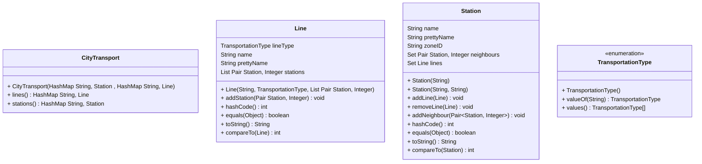
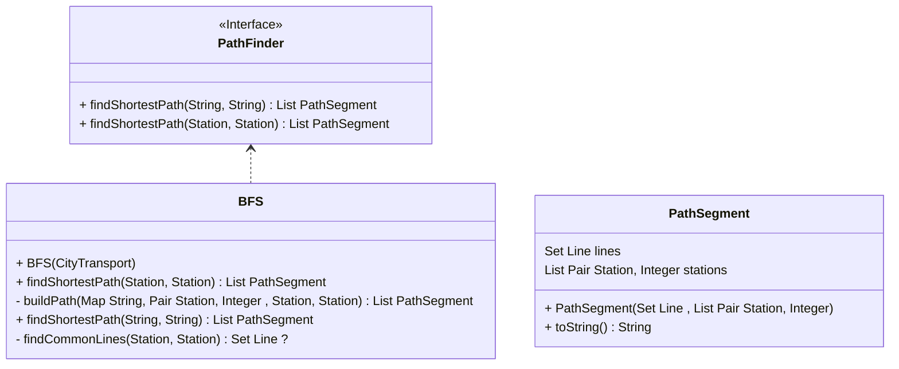
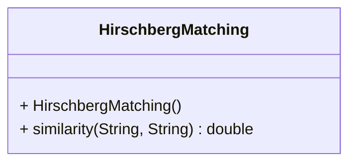
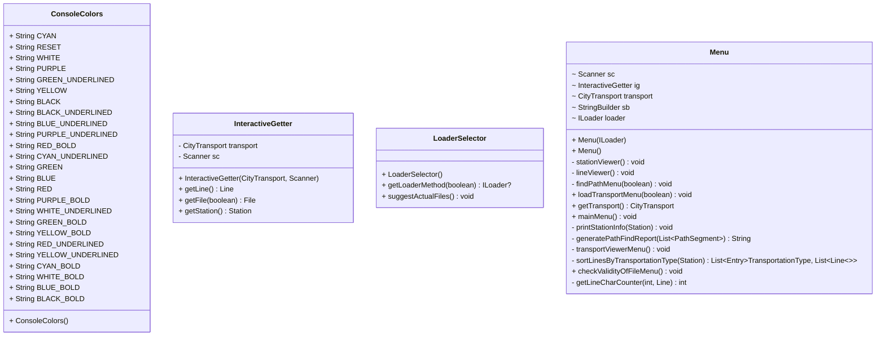
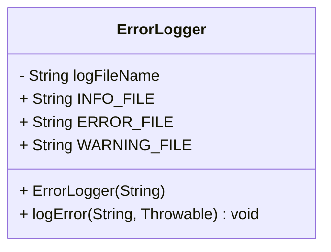

# Spoje v městské hromadné dopravě
## Motivace a popis problému
Úkolem je vytvořit program, který bude vyhledávat možná spojení městské
hromadné dopravy ze stanice na stanici a vypisovat dobu trvání.
K sadě jsem si vybral otevřená data Prazské integrované dopravy.

Osobní motivací je, abych implementoval úlohu, kterou již mám v C++ vyřešenou
pomocí algoritmu BFS (vyhledávání do šířky), zkusil si kód napsat v Javě.
Zároveň chci mé řešení rozšířit pouze ze stanic metra i na tramvaje,
autobusy, trolejbusy, vlaky, přívozy a lanové pozemní dráhy. 

## Řešení
Program načte ze souboru názvy stanic MHD a délku přesunu mezi nimi, následně
vytvoří neorientovaný graf, nad kterým bude vyhledávat cesty pomocí algoritmu
Vyhledávání do šířky.

Program po spuštění disponuje nabídkou funkcí:
 - Hledat cestu
   - název stanice Z (s podporou suggesce podobné stanice, pokud zadané jméno neexistuje)
   - název stanice DO (s podporou suggesce podobné stanice, pokud zadané jméno neexistuje)
 - Hledat cestu s možností uložení výsledku
   - název stanice Z (s podporou suggesce podobné stanice, pokud zadané jméno neexistuje)
   - název stanice DO (s podporou suggesce podobné stanice, pokud zadané jméno neexistuje)
 - Prohledávání stanic a linek
   - Stanic
     - Název stanice (s podporou suggesce podobné stanice, pokud zadané jméno neexistuje)
   - Linek
     - Název linky (s podporou suggesce podobné stanice, pokud zadané jméno neexistuje)
 - Načítání nových stanic
   - cesta k souboru (s podporou REGEX)
 - Kontrola validity souboru
   - cesta k souboru (s podporou REGEX)
 - Opuštění programu

### Class diagram
#### Načítání, ukládání dopravy a validace souborů
```mermaid
classDiagram
direction BT
class BinaryLoader {
  + BinaryLoader() 
    HashMap String, Line  allLines
    HashMap String, Station  allStations
  + getAllStations() HashMap String, Station 
  + loadFile(String) boolean
  + getAllLines() HashMap String, Line 
}
class GTFSLoader {
  + GTFSLoader() 
  - HashMap String, Station  allStations
  - HashMap String, Line  allLines
  + getAllLines() HashMap String, Line 
  + getAllStations() HashMap String, Station 
  + loadFile(String) boolean
}
class ILoader {
<<Interface>>
  + computeNeighbours(HashMap String, Line ) void
  + getAllLines() HashMap String, Line 
  + loadFile(String) boolean
  + getAllStations() HashMap String, Station 
}
class TextLoader {
  + TextLoader() 
    HashMap String, Station  allStations
    HashMap String, Line  allLines
  + getAllStations() HashMap String, Station 
  + loadFile(String) boolean
  + getAllLines() HashMap String, Line 
}

BinaryLoader  ..>  ILoader 
GTFSLoader  ..>  ILoader 
TextLoader  ..>  ILoader 

class BinarySaver {
  + BinarySaver(CityTransport) 
  - CityTransport transport
  + saveTransport(String) boolean
}
class DescriptionSaver {
  + DescriptionSaver() 
  + saveTextToFile(File, String) void
}
class ISaver {
<<Interface>>
  + saveTransport(String) boolean
}
class TextSaver {
  + TextSaver(CityTransport) 
  - CityTransport transport
  + saveTransport(String) boolean
}

BinarySaver  ..>  ISaver 
TextSaver  ..>  ISaver 

classDiagram
direction BT
class BinaryValidator {
  + BinaryValidator() 
  + validateFile(File) boolean
}
class IValidator {
<<Interface>>
  + validateFile(File) boolean
}
class TextValidator {
  + TextValidator() 
  + validateFile(File) boolean
}

BinaryValidator  ..>  IValidator 
TextValidator  ..>  IValidator 
```
### Hromadná doprava

### Hledání spojů - Pathfinding

### PatternMatcher

### Nástroje
```mermaid
classDiagram
direction BT
class LangFormatter {
  + LangFormatter() 
  + formatCzechMinutes(int) String
}
class Pair K, T  {
  + Pair(K, T) 
  + T second
  + K first
  + compareTo(Pair K, T ) int
}
class PathBuilder {
  + PathBuilder() 
  + joinPath(String[]) String
}
class TextNormalization {
  + TextNormalization() 
  - StringBuilder sb
  - HashMap Integer, Integer  map
  + stringNormalize(String) String
}
```
### Uživatelské rozhraní

### Zpracování chyb



## Testování
K testování poslouží knihovna JUnit verze 5.

__Status JUnit5 testů__ [](https://github.com/TUL2223ALG/2223alg2-semestralproject-daniel.adamek/actions/workflows/maven.yml)

## Splněné požadavky
- [x] Menu, které umožní opakovaný výběr funkcí aplikácie a ukončení aplikace
- [X] Víceúrovňové menu - zobrazovat vždy jenom zrovna dostupné  volby
- [x] Přehledný výpis výsledků na konzoli - použijte alespoň jednou String.format() a StringBuilder
- [x] Načítání vstupních dat z minimálně dvou souborů
- [X] Zápis výstupních dat do souboru
- [x] Možnost výběru práce s textovými nebo binárními soubory (načítání i výpis)
- [X] Kontrolní program pro výpis binárního souboru
- [x] Ideálně využití reálných otevřených dat
- [x] Adresář data (na rovnaké úrovni jako src) se všemi datovými soubory a případně třídu Datastore se statickými metodami, které budou poskytovat další statická data
- [x] Nastavení cesty k adresáři data uživatelem na začátku programu, nebo v konfiguračním souboru
- [x] Rozdělení tříd do balíčků. Např.
  - ui – třídy, tvořící uživatelské rozhraní - komunikaci s uživatelem
  - app – třídy, tvořící logiku a práci s daty - modely, kontrolery
  - utils – pomocné třídy např. vlastní výjimky, vlastní rozhraní
- [x] Programování vůči rozhraní a použití vlastního rozhraní
- [x] Použití java.time API pro práci s časem
- [x] Použít enum typ
- [x] Použití kontejnerové třídy jazyka Java (ArrayList, LinkedList, HashMap ...) z Collections frameworku.
- [X] Alespoň dvě možnosti třídění s využitím rozhraní Comparable a Comparator
- [x] Použití regulárního výrazu
- [x] Ošetření vstupů, aby chybné vstupy nezpůsobily pád programu - pomocí existujících a vlastních výjimek
- [x] Vhodné ošetření povinně ošetřovaných výjimek
- [x] Použití Vámi vybrané externí knihovny (audio, posílání emailů, práce s obrázkem, junit testování, jiné formáty uložení dat ...)
- [x] Javadoc - každá třída a metoda musí mít javadoc popis, abyste mohli na závěr vygenerovat javadoc dokumentaci
- [x] Vhodné hlášky pro uživatele nebo Help, aby mohl aplikaci otestovat i ten, kdo ji netvořil

