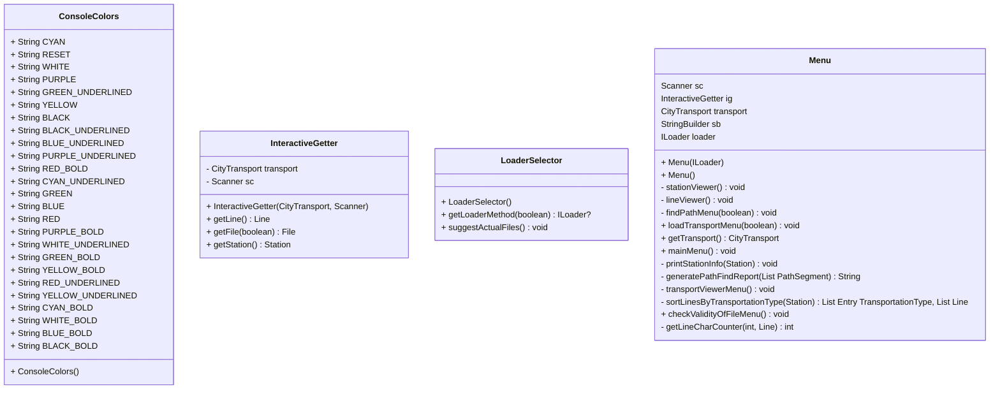

# Spoje v městské hromadné dopravě
## Motivace a popis problému
Úkolem je vytvořit program, který bude vyhledávat možná spojení městské
hromadné dopravy ze stanice na stanici a vypisovat dobu trvání.
K sadě jsem si vybral otevřená data Prazské integrované dopravy.

Osobní motivací je, abych implementoval úlohu, kterou jsem již implementoval v C++ pouze pro
stanice metra bez délky přesunu a pomocí algoritmu BFS (vyhledávání do šířky).

Chci tento nápad implementovat v Javě a nad skutečnými (open daty), rozšířit na všechny druhy dopravy,
které disponují hromadné dopravy v Praze či Liberci (autobus, tramvaj, metro, trolejbus, přívoz,
lanové (pozemní) dráhy). 

## Řešení
Program načte ze souboru názvy stanic MHD a délku přesunu mezi nimi, následně
vytvoří neorientovaný graf, kde vrcholy bude reprezentovat stanice a hrany úseky linek, 
nad kterým bude vyhledávat cesty pomocí algoritmu prohledávání do šířky.

Program po spuštění disponuje nabídkou funkcí:
1. Hledat cestu
   - název stanice Z _(* pozn. 1)_
   - název stanice DO _(* pozn. 1)_
1. Hledat cestu s možností uložení výsledku
   - název stanice Z _(* pozn. 1)_
   - název stanice DO _(* pozn. 1)_
1. Prohledávání stanic a linek
   - Prohledávání stanic
     - Název stanice _(* pozn. 1)_
   - Prohledávání linek
     - Název linky _(* pozn. 1)_
1. Načítání nových stanic
   - cesta k souboru (s podporou REGEX)
1. Kontrola validity souboru
   - cesta k souboru (s podporou REGEX)
1. Opuštění programu

 _* Pozn. 1 s podporou suggesce podobné stanice, pokud zadané jméno neexistuje_

### Popis struktury vstupních a výstupních souborů

Textové soubory, které jsou vygenerovány tímto programem mají následující strukturu:
1. STATIONS (vytvoření substitucí pro linky)
2. LINES

Jednotlivé stanice mají strukturu:
- SUBSTITUČNÍ_ČÍSLO|Jméno|Pásmo **nový řádek**

Jednotlivé linky mají strukturu:
- Jméno/Číslo linky|Typ dopravy|SUBSTITUČNÍ_ČÍSLO,ČAS_CESTY_NA_DALŠÍ_ZASTÁVKU;ČÍSLO,DOBA; ...

Binární soubory jsou ve stejném formátu, avšak uložené binárně

### Class diagram
#### Načítání, ukládání dopravy a validace souborů

### Hromadná doprava

### Hledání spojů - Pathfinding

### PatternMatcher

### Nástroje

### Uživatelské rozhraní

### Zpracování chyb

## Testování
### Pro účely uživatelů
Testovací sada obsahuje 4 souborů:
- data/pid.txt - textový soubor pro načtení
- data/pid-broken.txt - textový soubor pro načtení - poškozený
- data/pid.ser - binární soubor pro načtení
- data/pid-broken.ser - binární soubor pro načtení - poškozený
- data/PID_GTFS.ser - GTFS formát pro načtení

Možné testovací scénáře _(= všechny stanice PID)_.

Vyhledávání spojů a informace o stanicích:
- Černý most _(příjezd autobusů z Liberce)_
- Můstek
- I. P. Pavlova
- Nebozízek _(lanová dráha)_
- Výtoň _(přívoz)_
- Václavské náměstí

Vyhledávání linek:
- Metro
  - A
  - B
  - C
- Přívoz
  - P5
  - P6
  - P7
- Lanová dráha
  - LD
- Tramvaj
  - 1
  - 18
  - 22
- Autobus
  - 191
  - 256
  - 512
- Vlak
  - S1
  - R45

Validace souborů:
- data/pid.txt - textový soubor
- data/pid-broken.txt - textový soubor - poškozený
- data/pid.ser - binární soubor
- data/pid-broken.ser - binární soubor - poškozený

### Manuální testování
Je uvedeno v složce manual-test. Soubory odpovídají:
- koncovka "-in.txt" - vstup
- koncovka "-out.txt" - reálný výstup
- koncovka "-correct.txt" - chtěný výstup

Všechny reálné výstupy odpovídají chtěným výstupům

### Automatické testování
Automatické testování slouží knihovna JUnit verze 5.

Vyjmenované testy:
- BinaryLoaderTest
- TextLoaderTest
- HirsbergMatchingTest
- PathBuilderTest
- NextNormalizationTest
- BinaryValitatorTest
- TextValitatorTest

__Status JUnit5 testů__ 

## Popis fungování externí knihovny
Modul org.onebusaway-gtfs je knihovna pro práci s formátem General Transit Feed Specification (GTFS), 
který slouží k popisu jízdních řádů a veřejné dopravy. Tento modul poskytuje nástroje pro čtení a zpracování GTFS dat.

Fungování modulu org.onebusaway-gtfs lze shrnout do několika kroků:

1. Čtení GTFS dat: Modul umožňuje načítání GTFS souborů, které obsahují informace o různých aspektech 
veřejné dopravy, jako jsou zastávky, linky, jízdní řády, cesty atd. Tato data jsou uložena ve strukturovaném formátu.

1. Mapování dat: Po načtení GTFS dat modul provádí mapování těchto dat na interní objekty, 
které reprezentují jednotlivé prvky veřejné dopravy. Například z GTFS zastávky se vytvářejí objekty
reprezentující zastávky ve vnitřním datovém modelu.

1. Zpracování a validace: Modul provádí různé operace zpracování a validace GTFS dat. To zahrnuje kontrolu
správnosti dat, například zda jsou všechny povinné položky přítomny, správný formát časů a dalších atributů.

1. Poskytování funkcionalit: Modul poskytuje různé funkce a metody pro práci s GTFS daty. To může zahrnovat
zjišťování stanic, zjišťování linek, zobrazování informací o jízdách a další.

Celkově lze říci, že modul org.onebusaway-gtfs usnadňuje práci s GTFS daty a umožňuje programátorům snadno
načítat, zpracovávat a využívat tato data pro různé účely ve veřejné dopravě.

## Splněné požadavky
- [x] Menu, které umožní opakovaný výběr funkcí aplikácie a ukončení aplikace
- [X] Víceúrovňové menu - zobrazovat vždy jenom zrovna dostupné  volby
- [x] Přehledný výpis výsledků na konzoli - použijte alespoň jednou String.format() a StringBuilder
- [x] Načítání vstupních dat z minimálně dvou souborů
- [X] Zápis výstupních dat do souboru
- [x] Možnost výběru práce s textovými nebo binárními soubory (načítání i výpis)
- [X] Kontrolní program pro výpis binárního souboru
- [x] Ideálně využití reálných otevřených dat
- [x] Adresář data (na rovnaké úrovni jako src) se všemi datovými soubory a případně třídu Datastore se statickými metodami, které budou poskytovat další statická data
- [x] Nastavení cesty k adresáři data uživatelem na začátku programu, nebo v konfiguračním souboru
- [x] Rozdělení tříd do balíčků. Např.
  - ui – třídy, tvořící uživatelské rozhraní - komunikaci s uživatelem
  - app – třídy, tvořící logiku a práci s daty - modely, kontrolery
  - utils – pomocné třídy např. vlastní výjimky, vlastní rozhraní
- [x] Programování vůči rozhraní a použití vlastního rozhraní
- [x] Použití java.time API pro práci s časem
- [x] Použít enum typ
- [x] Použití kontejnerové třídy jazyka Java (ArrayList, LinkedList, HashMap ...) z Collections frameworku.
- [X] Alespoň dvě možnosti třídění s využitím rozhraní Comparable a Comparator
- [x] Použití regulárního výrazu
- [x] Ošetření vstupů, aby chybné vstupy nezpůsobily pád programu - pomocí existujících a vlastních výjimek
- [x] Vhodné ošetření povinně ošetřovaných výjimek
- [x] Použití Vámi vybrané externí knihovny (audio, posílání emailů, práce s obrázkem, junit testování, jiné formáty uložení dat ...)
- [x] Javadoc - každá třída a metoda musí mít javadoc popis, abyste mohli na závěr vygenerovat javadoc dokumentaci
- [x] Vhodné hlášky pro uživatele nebo Help, aby mohl aplikaci otestovat i ten, kdo ji netvořil

